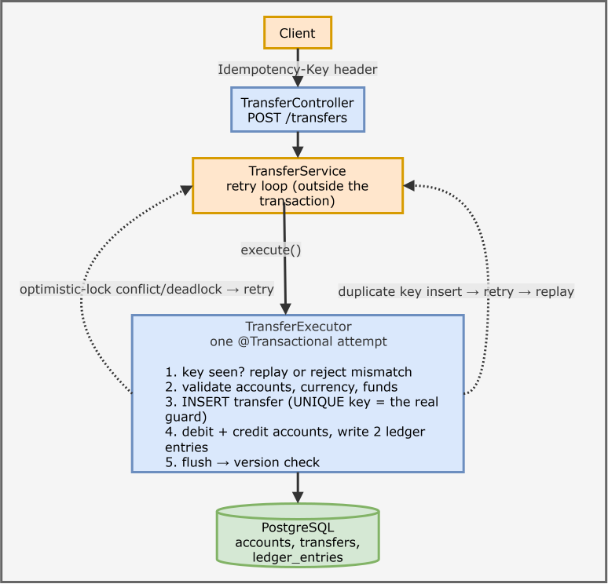

# Payments Ledger

An idempotent, double-entry payments ledger built with **Java 21, Spring Boot 3.5, PostgreSQL and Flyway**.
Money moves exactly once even when clients retry or fire duplicate requests concurrently.

## Features

- **Double-entry bookkeeping**: every transfer writes one DEBIT and one CREDIT of the same amount; total money across all accounts is always 0.
- **Idempotent transfers**: `Idempotency-Key` header; same key + same body replays the original result, same key + different body is rejected (422).
- **Optimistic locking** (`@Version`) with bounded, jittered retries, so concurrent transfers never lose an update or overdraw an account.
- **Database safety nets**: unique constraint on the idempotency key, `CHECK (balance >= 0)`, foreign keys, positive-amount checks.
- **OpenAPI / Swagger UI**, RFC 7807 `problem+json` errors, Flyway migrations.
- **Integration tests on real PostgreSQL** (Testcontainers), including concurrency tests, plus GitHub Actions CI.

## Architecture



Deposits are just transfers from a seeded system funding account (`allow_negative = true`), so they follow the same idempotent double-entry path.
Amounts are `long` minor units (paise / cents), never floating point.

## Run it

Requirements: JDK 21, Docker.

```powershell
docker compose up -d                 # PostgreSQL 16
./mvnw spring-boot:run               # app on http://localhost:8080
```

Swagger UI: <http://localhost:8080/swagger-ui.html>
Demo script (PowerShell): `powershell -ExecutionPolicy Bypass -File .\scripts\demo.ps1`
Everything in Docker instead: `docker compose --profile app up --build`

## API

| Method | Path | Notes |
|---|---|---|
| POST | `/api/v1/accounts` | `{ownerName, currency}` (INR or USD) -> 201 |
| GET | `/api/v1/accounts/{id}` | balance in minor units |
| POST | `/api/v1/accounts/{id}/deposits` | `Idempotency-Key` header, `{amount}` |
| POST | `/api/v1/transfers` | `Idempotency-Key` header, `{fromAccountId, toAccountId, amount, currency}` -> 201, or 200 on replay (`Idempotent-Replayed: true`) |
| GET | `/api/v1/transfers/{id}` | transfer with its two ledger entries |

Errors: 400 validation / missing key, 404 unknown account, 409 too much contention (retry), 422 insufficient funds or key reuse with a different body.

## Tests

```powershell
./mvnw verify    
```

- happy path writes balanced entries; insufficient funds changes nothing
- replay returns 200 with an identical body and moves money once; key reuse with a different body is 422
- **16 concurrent duplicate requests apply exactly once**
- **20 concurrent distinct transfers from one account: no lost updates, no overdraft**
- after every test: total balance is 0 and every cached balance equals the sum of its ledger entries

## Notes and trade-offs

- **Why the unique constraint, not the lookup, guarantees exactly-once**: two requests can both pass the "seen this key?" check; the second INSERT then fails on the unique index, rolls back, and its retry replays the winner.
- **Why a separate `TransferExecutor` bean**: `@Transactional` works through a proxy, so the retry loop must sit outside the transaction and call across beans to get a fresh transaction per attempt.
- **Optimistic vs pessimistic locking**: optimistic keeps locks short and fits low-to-moderate contention per account; a single very hot account would favour `SELECT ... FOR UPDATE`.
- **Deadlocks**: `hibernate.order_updates` gives a consistent update order, and the retry loop also treats deadlock victims as retryable.
- **Known limits**: failed requests are not stored against their key; keys are global rather than per client; the funding account is a hot row; no keys TTL yet.

